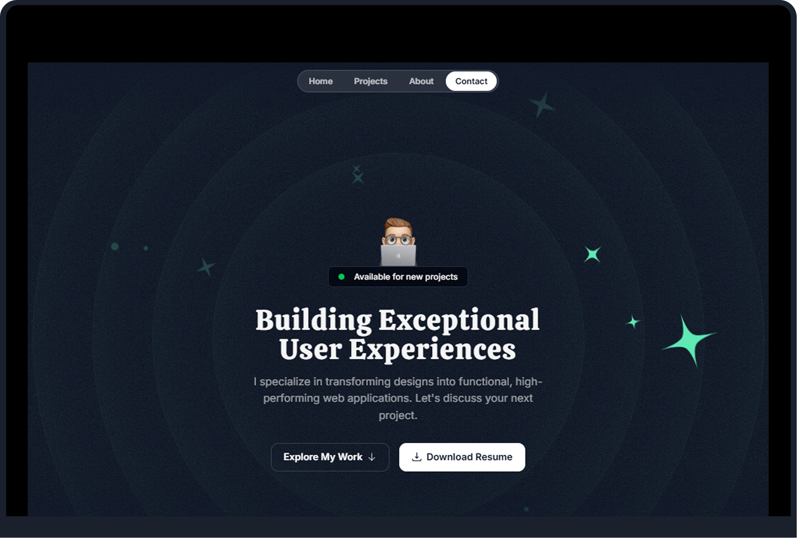
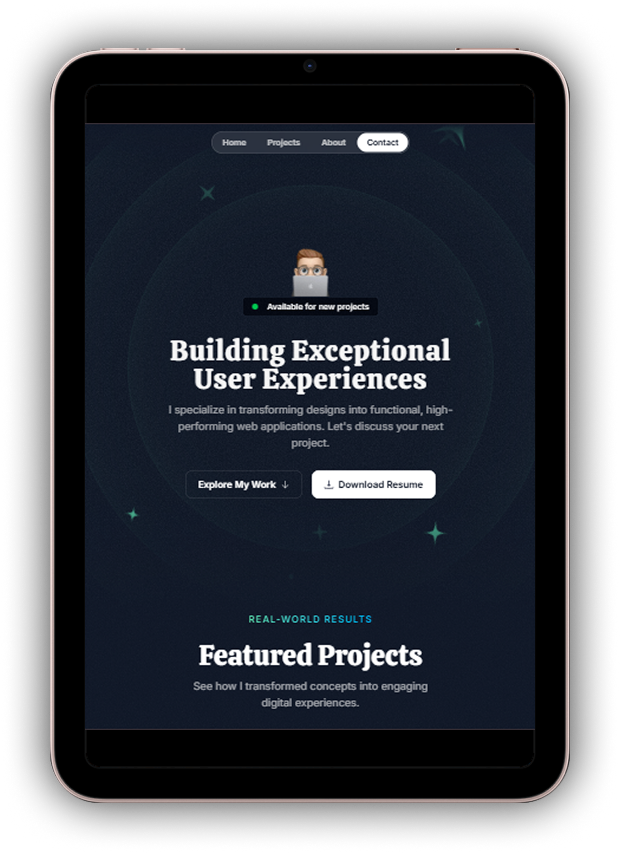
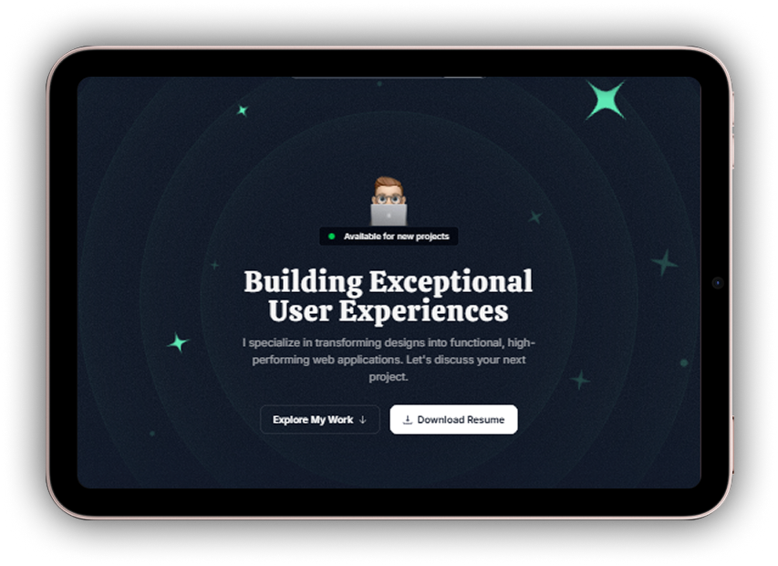

# ShamimTheDev Portfolio



A modern and responsive portfolio website built with **Next.js**, **TypeScript**, and **Tailwind CSS**. This portfolio showcases my skills, projects, and experience as a front-end developer. Designed for performance and simplicity, it provides a seamless user experience across all devices.

## Features

- **Modern Design**: Clean and intuitive UI built with Tailwind CSS.
- **Responsive Layout**: Works seamlessly on all screen sizes.
- **Fast Performance**: Optimized with Next.js for fast loading and SEO.
- **Project Showcase**: Highlighting my best work and skills.
- **Contact Section**: Easy way to get in touch.

## Technologies Used

- **Next.js**: A React framework for server-side rendering and static site generation.
- **TypeScript**: For type-safe and scalable code.
- **Tailwind CSS**: A utility-first CSS framework for rapid UI development.

## Getting Started

### Prerequisites

- Node.js (v16 or higher)
- npm or yarn

### Installation

1. Clone the repository:
   ```bash
   git clone https://github.com/your-username/shamimthedev-portfolio.git
2. Navigate to the project directory:
    ```bash
    cd shamimthedev-portfolio
3. Install dependencies:
    ```bash
    npm install
    # or
    yarn install
4. Start the development server:
    ```bash
    npm start
    # or
    yarn start
5. Open your browser and navigate to http://localhost:3000.

## Deployment
This app is deployed on Vercel. To deploy your own version:

1. Fork this repository.
2. Connect your GitHub account to Vercel.
3. Import the repository into Vercel.
4. Add the required environment variables in the Vercel dashboard.
5. Deploy your app.

## Screenshots





## Contributing
This is a personal portfolio project, so contributions are not expected. However, if you have suggestions or feedback, feel free to open an issue.

## License

This project is licensed under the MIT License. See the [LICENSE](./LICENSE) file for details.

## 📞 Contact
If you have any questions or feedback, feel free to reach out:

- Md. Shamim Hossain
- Email: shamimthedev@gmail.com
- GitHub: shamimthedev
- Portfolio: shamimthedev.vercel.app

### Made with ❤️ by Md. Shamim Hossain